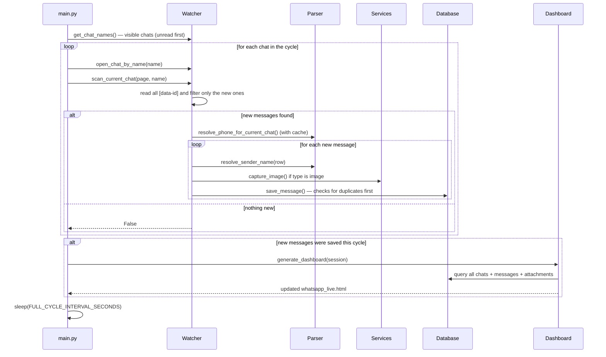
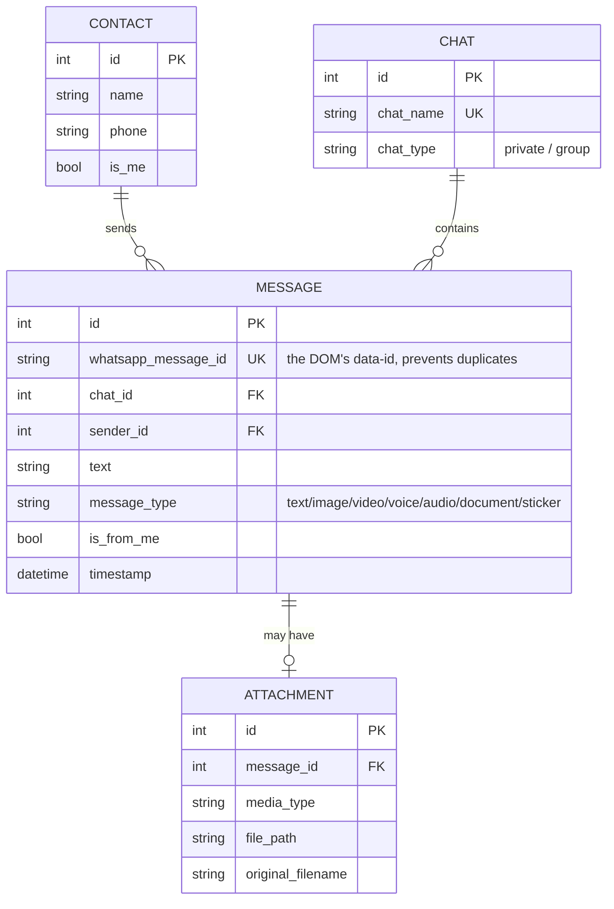

# 💬 WhatsApp Sync

A tool that runs alongside **WhatsApp Web** and watches it in real time.
Every new message that arrives (text, image, voice, video, document...)
gets saved automatically into a local database, while a simple HTML
dashboard updates live to show all conversations — all without any
external server or internet access beyond your own WhatsApp connection.

---

## 📖 The Idea

WhatsApp doesn't offer an official API for a regular personal account —
the official Business API is aimed at companies and comes with
complexity and cost that doesn't fit a personal project. The
alternative is to **read exactly what the browser itself sees**:
WhatsApp Web is a regular web page built on the DOM, so if we
programmatically "watch" that DOM, we can catch any message the moment
it appears — without touching any unofficial API or reverse-engineering
WhatsApp's own protocol.

The project is built on exactly this principle:

> Open a real browser (Playwright) → log in once (QR code) → keep the
> session alive → cycle through all chats → open each one → read new
> messages straight from the DOM → figure out who sent it and what type
> it is → save it → display it.

### Why is the project split this way?

Instead of one long script doing everything, each responsibility was
given its own module from the start — so that:

- If WhatsApp changes its page layout (which happens constantly), you
  know exactly where to update (usually `browser/`, `watcher/`, or
  `parser/`) without touching the rest of the project.
- Each piece can be tested/fixed in isolation (e.g. you can try
  `parser/sender.py` without spinning up the whole browser).
- Adding a new feature (like an API or a different database) becomes
  adding a new layer, not rewriting everything.

---

## 🧱 Architecture

The project is built as a **layered pipeline**, where each layer takes
the previous layer's output and hands it to the next:

```mermaid
flowchart LR
    A["🌐 WhatsApp Web<br/>(the live page)"] --> B["🖥️ Browser Layer<br/>browser/browser.py<br/>(Playwright + Session)"]
    B --> C["👀 Watcher Layer<br/>watcher/chats.py<br/>watcher/messages.py<br/>(discovers chats + new messages)"]
    C --> D["🔍 Parser Layer<br/>parser/sender.py<br/>parser/contacts.py<br/>(who sent it + their phone)"]
    D --> E["🧰 Services Layer<br/>services/media.py<br/>services/cache.py<br/>services/repository.py"]
    E --> F["🗄️ Database Layer<br/>database/models.py<br/>database/db.py<br/>(SQLite via SQLAlchemy)"]
    F --> G["📊 Dashboard Exporter<br/>dashboard/export.py"]
    G --> H["📄 whatsapp_live.html<br/>(live view, no internet needed)"]

    style A fill:#25D366,color:#fff
    style H fill:#075E54,color:#fff
```



All these layers are coordinated by **`main.py`**, fed by centralized
settings in **`config.py`**, and watched over by a per-service
**logging** setup (`logging_setup.py`).

### Layers in detail

| Layer | Responsibility | Files |
|---|---|---|
| **Browser** | Opens Chrome with a persistent session (`profile/`) so login only needs a QR scan once, and confirms the login succeeded | `browser/browser.py` |
| **Watcher** | Reads chat names from the sidebar and orders them (unread first), opens each chat, and reads message rows via `data-id` to avoid duplicates | `watcher/chats.py`, `watcher/messages.py` |
| **Parser** | Determines **who actually sent the message** (important in group chats, via `data-pre-plain-text`), and extracts the chat owner's **phone number** from Contact Info | `parser/sender.py`, `parser/contacts.py` |
| **Services** | Captures message images as screenshots, keeps an in-memory phone-number cache, and handles all save/deduplication logic against the database | `services/media.py`, `services/cache.py`, `services/repository.py` |
| **Database** | Defines the tables (Contact, Chat, Message, Attachment) and handles SQLAlchemy | `database/models.py`, `database/db.py` |
| **Dashboard** | Rebuilds an HTML page from the database every time new messages arrive | `dashboard/export.py` |
| **Orchestration** | Runs the full cycle, handles errors and reconnects, safe shutdown | `main.py` |
| **Cross-cutting** | Centralized config + per-service logging + a diagnostic script for selectors | `config.py`, `logging_setup.py`, `debug_dump.py` |

---

## 🗂️ Project Structure

```mermaid
flowchart TD
    ROOT["whatsapp_sync/"]
    ROOT --> MAIN["main.py — entry point & orchestration"]
    ROOT --> CONF["config.py — all settings in one place"]
    ROOT --> LOG["logging_setup.py — logging setup"]
    ROOT --> DEBUG["debug_dump.py — selector diagnostics tool"]
    ROOT --> REQ["requirements.txt"]

    ROOT --> BR["browser/"]
    BR --> BR1["browser.py"]

    ROOT --> WA["watcher/"]
    WA --> WA1["chats.py"]
    WA --> WA2["messages.py"]

    ROOT --> PA["parser/"]
    PA --> PA1["contacts.py"]
    PA --> PA2["sender.py"]

    ROOT --> SV["services/"]
    SV --> SV1["cache.py"]
    SV --> SV2["media.py"]
    SV --> SV3["repository.py"]

    ROOT --> DB["database/"]
    DB --> DB1["models.py"]
    DB --> DB2["db.py"]

    ROOT --> DASH["dashboard/"]
    DASH --> DASH1["export.py"]

    ROOT -.->|generated at runtime| PROFILE["profile/ (browser session)"]
    ROOT -.->|generated at runtime| MEDIA["media/images/&lt;chat&gt;/*.png"]
    ROOT -.->|generated at runtime| LOGS["logs/*.log"]
    ROOT -.->|generated at runtime| DBFILE["whatsapp.db"]
    ROOT -.->|generated at runtime| HTML["whatsapp_live.html"]
```



> The dotted folders (`profile/`, `media/`, `logs/`, `whatsapp.db`,
> `whatsapp_live.html`) don't exist in the code itself — they're
> generated automatically the first time you run `main.py`.

---

## 🔄 Workflow (the full run cycle)

Everything happens inside a `while True` loop in `main.py`. Each
**cycle** repeats every `FULL_CYCLE_INTERVAL_SECONDS` (5 seconds by
default):



### Error handling

- **Error in a single chat** (e.g. a selector didn't find an element)
  → logged to `logs/errors.log` and the cycle continues to the rest of
  the chats.
- **Browser closed / connection dropped** → `main.py` automatically
  tries to reopen the browser.
- **5 consecutive failed cycles** (`MAX_CONSECUTIVE_ERRORS`) → the
  program stops itself instead of looping forever on a broken state.

---

## 🗃️ Data Model (Database Schema)



**The key design decision:** duplicate protection relies on a
`UniqueConstraint` on `whatsapp_message_id` (not just an in-memory
set), so even if the program is closed and restarted, it won't
re-save messages that were already recorded.

---

## ⚙️ Running the Project

```bash
pip install -r requirements.txt
playwright install chromium

python main.py
```

The first time, Chrome will open and show you a QR code — scan it with
your phone like any new device. After that, the session is saved in
`profile/` and you won't need to scan again.

### Key settings (`config.py`)

| Setting | Default | Purpose |
|---|---|---|
| `MAX_CHATS_PER_CYCLE` | 15 | Max number of chats scanned per cycle |
| `FULL_CYCLE_INTERVAL_SECONDS` | 5 | How often the full cycle repeats |
| `MAX_CONSECUTIVE_ERRORS` | 5 | How many consecutive failures before the program stops |
| `HEADLESS` | False | Must be False the first time so you can scan the QR code |
| `DATABASE_URL` | `sqlite:///whatsapp.db` | Can be swapped for a PostgreSQL URL later |

### Diagnostic tool

If WhatsApp's selectors change and the code stops working correctly,
run:

```bash
python debug_dump.py
```

It opens your saved session and dumps the current sidebar HTML into
`chat_list_debug.html` so you can compare it and update the selectors
in `browser/browser.py`, `watcher/`, and `parser/`.

---

## ✅ What works right now

- Monitors all visible chats in the sidebar (up to `MAX_CHATS_PER_CYCLE`), unread ones first.
- Prevents duplicate messages via `data-id`.
- Identifies the real sender in group chats (instead of assuming every incoming message is from the chat owner).
- Actually captures message images (screenshot of the element itself) — no profile pictures are ever touched.
- A live dashboard (`whatsapp_live.html`) that updates automatically.
- Per-service logging, and resilience so one broken chat doesn't stop the whole cycle.

## 🚧 Next Steps

1. Scroll the sidebar to reach chats beyond the first 15.
2. Add a **FastAPI endpoint** to access the data from other apps (the library is already in `requirements.txt`).
3. Move from SQLite to PostgreSQL as the data grows.
4. Actually capture audio/video/document files (currently only the type is recorded).

## ⚠️ Important Notes

- The code relies on reading WhatsApp Web's DOM, which is an
  unofficial approach — any WhatsApp design update can break the
  selectors (`data-testid`, `aria-label`) in `browser/browser.py`,
  `watcher/messages.py`, and `parser/contacts.py`.
- Use this tool only on your own personal account and with data you
  own or have permission to collect — collecting other people's
  numbers/messages without their knowledge carries real privacy and
  legal considerations.
